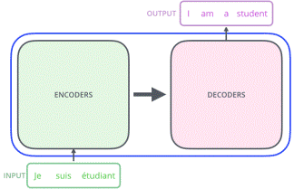
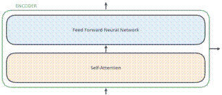
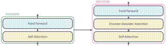
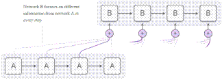
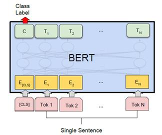
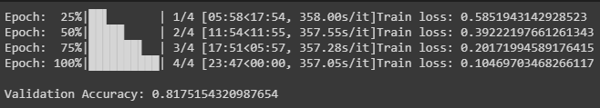
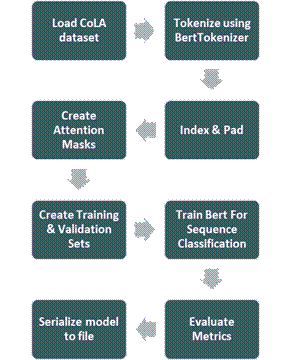

<!-- START doctoc generated TOC please keep comment here to allow auto update -->
<!-- DON'T EDIT THIS SECTION, INSTEAD RE-RUN doctoc TO UPDATE -->
**Table of Contents**  *generated with [DocToc](https://github.com/thlorenz/doctoc)*

- [GECwBERT](#gecwbert)
  - [I. Introduction](#i-introduction)
  - [II. Background](#ii-background)
    - [A. Transformers](#a-transformers)
    - [B. Attention](#b-attention)
    - [C. BERT](#c-bert)
    - [D. PyTorch-Transformers](#d-pytorch-transformers)
  - [III. Approach](#iii-approach)
  - [IV. Grammar Error Detection](#iv-grammar-error-detection)
    - [A.	Pre-trained model](#a%09pre-trained-model)
    - [B.	CoLA](#b%09cola)
    - [C.	Fine tuning](#c%09fine-tuning)
  - [V. Grammar Error Correction](#v-grammar-error-correction)
  - [VI. Results](#vi-results)
  - [VII.	Further Work](#vii%09further-work)
  - [Source](#source)
  - [References](#references)

<!-- END doctoc generated TOC please keep comment here to allow auto update -->

# GECwBERT
Use Language Model (LM) for Grammar Error Correction (GEC), without the use of annotated data.

## I. Introduction

Grammatical errors are of many different types, including articles or determiners, prepositions, noun form, verb form, subject-verb agreement, pronouns, word choice, sentence structure, punctuation, capitalization, etc. Of all the error types, determiners and prepositions are among the most frequent errors made by learners of English.[1]. The focus of this project is to correct errors in spellings, determiners, prepositions & action verbs using BERT as a language representation model.

Bidirectional Encoder Representations from Transformers (BERT) is designed to pretrain deep bidirectional representations from unlabelled text by jointly conditioning on both left and right context in all layers. As a result, the pre-trained BERT model can be finetuned with just one additional output layer to create state-of-the-art models for a wide range of tasks, such as question answering and language inference, without substantial task specific architecture modifications.[2] 

We plan to use BERT for 2 tasks 
•	Grammar Error Detection (GED) and 
•	Grammar Error Correction (GEC)

Specifically, for task related to GEC, we plan to do it without the use of any annotated training, and just rely on the language knowledge captured by the BERT Masked Language Model (MLM).

## II. Background

### A. Transformers

“Attention Is All You Need” (2018) [3], introduce the Transformer, a novel neural network architecture based on a self-attention mechanism that is particularly well suited for language understanding. Transformer, a model architecture eschewing recurrence and instead relying entirely on an attention mechanism to draw global dependencies between input and output. The Transformer allows for significantly more parallelization and can reach a new state of the art in translation quality after being trained for as little as twelve hours on eight P100 GPUs.
Transformers are made of two basic blocks of components, a bloc of Encoders and a block of Decoders.

Fig. 1.	Basic structure of a Transformer

The encoders are all identical in structure (yet they do not share weights). Each one is broken down into two sub layers: Self-attention & Feed Forward Neural Network

Fig. 2.	Transformer encoder high level structure

The decoder has both those layers, but between them is an attention layer that helps the decoder focus on relevant parts of the input sentence

Fig. 3.	Transformer decoder high level structure

### B. Attention

Attention is a mechanism that allows the decoder to selectively (dynamically) focus on the information rich phrases in the source sequence. The decoder takes a peek at the encoder states that are relevant to the current decoding step. This relevance sorting allows the decoder to pay attention to different parts of the source sequence at different decoding steps and improves its output. The attention mechanism was born to help memorize long source sentences in neural machine translation (NMT). Rather than building a single context vector out of the encoder’s last hidden state, the secret sauce invented by attention is to create shortcuts between the context vector and the entire source input.

Fig. 4.	Attention Mechanism

### C. BERT

One of the biggest challenges in natural language processing (NLP) is the shortage of training data. NLP is a diversified field with many distinct tasks, most task specific datasets contain only a few thousand or a few hundred thousand human labelled training examples. To help close this gap in data, researchers have developed a variety of techniques for training general purpose language representation models using large amounts of unannotated text on the web (known as pre training). The pre trained model can then be fine-tuned on small data NLP tasks like question answering and sentiment analysis, resulting in substantial accuracy improvements compared to training on these datasets from scratch. In February 2018, Google open sourced a new technique for NLP pre training called BERT. 

Fig. 5.	BERT bidirection structure

BERT alleviates the previously mentioned unidirectionality constraint by using a “masked language model” (MLM) pre-training objective, inspired by the Cloze task (Taylor, 1953). The masked language model randomly masks some of the tokens from the input, and the objective is to predict the original vocabulary id of the masked word based only on its context. Unlike left-to right language model pre-training, the MLM objective enables the representation to fuse the left and the right context, which allows us to pretrain a deep bidirectional Transformer. [2]

### D. PyTorch-Transformers

PyTorch-Transformers (formerly known as pytorch-pretrained-bert) is a library of state-of-the-art pre-trained models for Natural Language Processing (NLP). The library currently contains PyTorch implementations, pre-trained model weights, usage scripts and conversion utilities for the following models. [5]. We will be using this for our interface to BERT and its tasks.

## III. Approach

To carry out the task of Grammar Error Correction, we use a pre-trained BERT model, which is then fine tuned with We’ll use the Corpus of Linguistic Acceptability (CoLA) dataset for single sentence classification. It’s a set of sentences labelled as grammatically correct or incorrect. We use this fine-tuned BERT to give a model that can classify whether a sentence has grammatical error or not. This would give us the Grammar Error Detection (GED) model.
We would then use the Masked Language Model (MLM) of BERT to come up with alternate sentences and use the GED to come up with correction suggestions. The high-level approach would be:

•	Tokenize the sentence using Spacy
•	Check for spelling errors using Hunspell
•	For all preposition, determiners & action verbs, create a set of probable sentences
•	Create a set of sentences with each word “masked”, deleted or an additional determiner, preposition or helper verb added
•	Used BERT Masked Language Model to determine possible suggestions for masks
•	Use the GED model to select appropriate solutions

## IV. Grammar Error Detection

There are two steps in BERT framework: pre-training and fine-tuning. During pre-training, the model is trained on unlabeled data over different pre-training tasks. For finetuning, the BERT model is first initialized with the pre-trained parameters, and all the parameters are fine-tuned using labeled data from the downstream tasks.

### A.	Pre-trained model
We use the bert-base-uncased as the pre trained model. It consists of 12-layer, 768-hidden, 12-heads, 110M parameters and is trained on lower-cased English text. We also experimented with bert-large-uncased, which consists of 24-layer, 1024-hidden, 16-heads, 340M parameters which is trained on lower-cased English text. However, for our dataset, we did not find any significant difference in performance.

### B.	CoLA
Corpus of Linguistic Acceptability (CoLA) is a set of 10,657 English sentences labelled as grammatical or ungrammatical from published linguistics literature. We train models for acceptability classification. These trained models show promise on the task, and error-analysis on specific grammatical phenomena reveals that they learn some systematic generalizations like subject-verb object word order without any grammatical supervision.

### C.	Fine tuning
For fine-tuning we have used CoLA dataset for single sentence classification. The driving principle behind this approach is the concept of The Poverty of the Stimulus. The Poverty of the Stimulus argument holds that purely data-driven learning is not powerful enough to explain the richness and uniformity of human grammars, particularly with data of such low quality as children are exposed to (Clark and Lappin, 2011). This argument is generally wielded in support of the theory of a strong Universal Grammar, which claims that all humans share an innately given set of language universals, and that domain-general learning procedures are not enough to acquire language (Chomsky, 1965).[1]

Because the pre trained BERT layers already encode a lot of information about the language, training the classifier is relatively inexpensive. Rather than training every layer in a large model from scratch, it’s as if we have already trained the bottom layers 95% of where they need to be, and only really need to train the top layer, with a bit of tweaking going on in the lower levels to accommodate our task.

Fig. 6.	BERT single sentence classification task

We use the following hyperparameters for fine-tuning
•	Batch size of 32
•	Learning rate (Adam): 2e-5
•	Number of epochs: 4

Form the Pytorch-transformers, we use the BertForSequenceClassification API. This is a BERT model transformer with a sequence classification/regression head on top (a linear layer on top of the pooled output). The network is trained for 4 epochs, and on Google Colab with a Tesla K80 GPU, it takes about 25 minutes. After training we get a training loss of 0.1 and a validation accuracy of 0.81.

Fig. 7.	Training loss & validation accuracy of BertForSequenceClassification

Following flowchart summarizes the process:

Fig. 8.	Training Bert Model for classifying gramatically erroneous sentences

Using the out of domain validation data to calculate the Matthews correlation coefficient, we achieve a value of 0.44.  The fine-tuned model is saved as 'bert-based-uncased-GED.pth' in the model folder

## V. Grammar Error Correction

We would then use the Masked Language Model (MLM) of BERT to come up with alternate sentences and use the GED to come up with correction suggestions. The high-level approach would be:

•	Tokenize the sentence using Spacy
•	Check for spelling errors using Hunspell
•	For all preposition, determiners & helper verbs, create a set of probable sentences
•	Create a set of sentences with each word “masked”, deleted or an additional determiner, preposition or helper verb added
•	Used BERT Masked Language Model to determine possible suggestions for masks
•	Use the GED model to select appropriate solutions
The flowchart for the same is as below:

Fig. 9.	Grammar Error Correction using BERT

The steps in green above are where are using BERT. Some key tweaks we have done from the perspective of grammar are:

•	BERT MLM would suggest alternate words for existing nouns. The resultant sentence would have a valid grammar, but that is usually not the purpose of this exercise.
•	In case of nouns, we SequenceMatcher from python difflib to only allow suggestions which are like the word being replaced. In future, we plan to also use stem words using Spacy / Hunspell.
•	We restrict addition & deletion for only prepositions, determiners & helper verbs
•	From the logits at the softmax layer, we calculate the probability of the sentence being grammatically correct, and use that to filter out the possible suggestions

These tweaks have enabled us to get suggested sentences after grammatical error correction that are close in meaning to the original sentence

## VI. Results

We used reference sentences from various papers to check our implementation. The results are as follows.

The suggestions by our system not only match the reference output, but also give some very interesting suggestions that are equally valid.

| Source	| HES CSCI S-89A Lecture Notes |
| -- | --|
|Original Sentence	| They drank the pub.|
|Reference Response	|- |
|Our suggestions	|they drank at the pub.|

Although, in modern lingo, the original sentence might be ok, but the suggestion is grammatically better.

|Source	|Language Model Based Grammatical Error Correction without Annotated Training Data [6]|
| -- | --|
|Original Sentence	|I am looking forway to see you soon.|
|Reference Response	|I am looking forward to see you soon.   I am looking forward to seeing you soon.|
|Our suggestions	|I am looking for a way to see you soon.   I am looking at Norway to see you soon.   I am looking forward to seeing you soon.   I am looking forward to see you soon.   Am I looking forward to see you soon.|

The system suggestions are inline with the reference, but it also gives some additional suggestions, that are smarter than what most systems would come up with.

|Source	|The CoNLL-2013 Shared Task on Grammatical Error Correction – m2scorer – examples - score_gold [1]|
| -- | --|
|Original Sentence	|The cat sat at mat. Giant otters is an apex predator.|
|Reference Response	|Giant otters are an apex predator. The cat sat on the mat. / The cat sat at the mat.|
|Our suggestions	|giant otters are an apex predator  the cat sat at the mat|

We match the outputs for the examples in the golden source.

|Source	|The CoNLL-2013 Shared Task on Grammatical Error Correction – official-preprocessed [1]|
| -- | --|
|Original Sentence	|There is no a doubt, tracking system has brought many benefits in this information age.|
|Reference Response	|There is no doubt, tracking systems have brought many benefits in this information age.|
|Our suggestions	|there is no doubt, the tracking system has brought many benefits in this information age. there is no doubt, tracking the system has brought many benefits in this information age.|

We do not match the reference output verbatim, but if you see both the suggestions given by the system are equally valid interpretation of the original sentence.

In conclusion, not only does the system give grammar corrections, some corrections are smarter than what you will expect

## VII.	Further Work

The work presented here is an initial prototype to prove that a general language model like BERT can be used for tasks such as grammar error correction, without the use of annotated data. Further work would be first benchmark these results using CoNLL Shared Task on Grammatical Error Correction [1]. Based on the results refinements & improvements to the approach would be worked out.

## Source

Source code in form of the following jupyter notebooks:

•	BERT_GED_Model.ipynb – Contains the code to fine tune BERT Model for a single sentence classification task, using the CoLA dataset. Resulting model is used in the Grammar Error Correction Stage

•	BERT_GEC_Implementation – Implements the grammar error corrector using BERT Masked Language Model.

The code has been tested on Google Colab with GPU runtime. All required files are downloaded by the code, and no additional uploads are required.

This paper and a short presentation giving brief details of the project is also available as part of this repository.

## References

[1]	H. Ng, S. Wu, Y. Wu, C. Hadiwinoto and J. Tetreault, “The CoNLL-2013 Shared Task on Grammatical Error Correction,” Proceedings of the Seventeenth Conference on Computational Natural Language Learning: Shared Task, pages 1–12, Sofia, Bulgaria, August 8-9 2013

[2]	J. Devlin, M. Chang, K. Lee, and K. Toutanova, “BERT: Pre-training of Deep Bidirectional Transformers for Language Understanding”: arXiv:1810.04805v2 [cs.CL] 24 May 2019.

[3]	A. Vaswani, et al, “Attention Is All You Need”: arXiv:1706.03762v5 [cs.CL] 6 Dec 2017

[4]	R. Horev, “BERT Explained: State of the art language model for NLP”: https://towardsdatascience.com/bert-explained-state-of-the-art-language-model-for-nlp-f8b21a9b6270

[5]	Huggingface, “Pytorch Transformers”:  https://github.com/huggingface/pytorch-transformers

[6]	C. Bryant and T. Briscoe, “Language Model Based Grammatical Error Correction without Annotated Training Data”: Proceedings of the Thirteenth Workshop on Innovative Use of NLP for Building Educational Applications, pages 247–253

